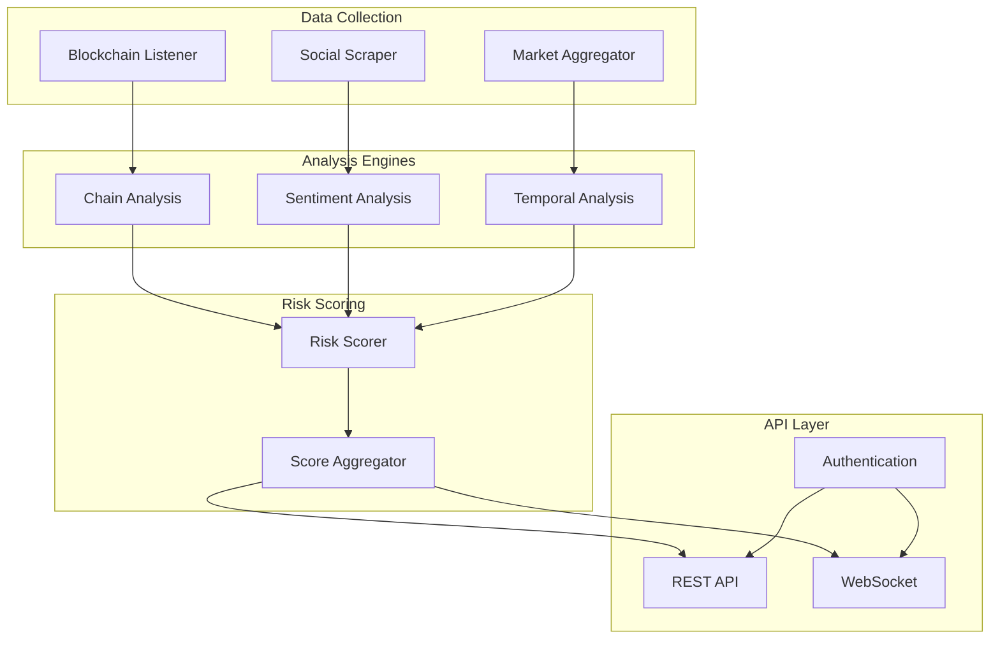

# KADES High-Level Architecture

## System Overview

The Kinetic Anomaly Detection Engine System (KADES) is a sophisticated system designed to detect and analyze anomalies in Solana token trading patterns. It combines real-time blockchain data analysis, social sentiment monitoring, and machine learning to provide comprehensive market intelligence.

## Core Components

### 1. Data Collection Layer
- **Blockchain Listener**
  - Monitors Solana blockchain for token transactions
  - Real-time event processing
  - Efficient data filtering and preliminary analysis

- **Social Media Scraper**
  - Multi-platform data collection (Twitter, Telegram, Discord)
  - Rate-limited API interactions
  - Data normalization and preprocessing

- **Market Data Aggregator**
  - Price and volume data collection
  - Liquidity pool monitoring
  - Order book analysis

### 2. Analysis Layer
- **Chain Analysis Engine**
  - Transaction pattern recognition
  - Whale movement detection
  - Smart contract interaction analysis
  - Liquidity pool monitoring

- **Sentiment Analysis Engine**
  - Natural Language Processing (NLP)
  - Multi-language support
  - Context-aware sentiment scoring
  - Social trend analysis

- **Temporal Analysis Engine**
  - Time-series analysis
  - Pattern recognition
  - Anomaly detection
  - Price prediction

### 3. Risk Scoring Layer
- **Score Aggregator**
  - Multi-factor risk analysis
  - Weight optimization
  - Historical correlation analysis
  - Confidence scoring

### 4. API Layer
- **REST API**
  - Token analysis endpoints
  - Historical data access
  - Analytics and reporting
  - Authentication and rate limiting

- **WebSocket Service**
  - Real-time alerts
  - Live market data
  - Connection management
  - Load balancing

## System Architecture Diagram

## Data Flow

1. **Data Ingestion**
   - Blockchain events are captured in real-time
   - Social media data is collected through platform APIs
   - Market data is aggregated from DEX contracts

2. **Processing Pipeline**
   - Raw data is normalized and preprocessed
   - Multiple analysis engines process data concurrently
   - Results are aggregated and scored

3. **Output Generation**
   - Risk scores are calculated
   - Alerts are generated
   - Data is cached for API access

## Key Technical Decisions

### 1. Performance Optimization
- Asynchronous processing
- In-memory caching
- Efficient data structures
- Batch processing where applicable

### 2. Scalability
- Microservices architecture
- Horizontal scaling capability
- Load balancing
- Message queuing

### 3. Reliability
- Error handling and retry mechanisms
- Circuit breakers
- Data validation
- Monitoring and alerting

### 4. Security
- API key authentication
- Rate limiting
- Data encryption
- Access control

## Infrastructure Requirements

### Compute Resources
- High-performance CPU for analysis
- Sufficient RAM for in-memory processing
- SSD storage for data caching
- Network bandwidth for real-time data

### External Dependencies
- Solana RPC nodes
- Social media APIs
- Market data providers
- Time-series database

### Monitoring
- System metrics
- Error tracking
- Performance monitoring
- API usage analytics

## Deployment Strategy

### Development Environment
- Local development setup
- Test networks
- Mock data sources
- CI/CD pipeline

### Staging Environment
- Production-like setup
- Load testing
- Integration testing
- Performance tuning

### Production Environment
- High availability
- Auto-scaling
- Redundancy
- Disaster recovery

## Future Considerations

### Planned Enhancements
- Additional blockchain support
- Enhanced ML models
- Advanced pattern recognition
- Custom scoring algorithms

### Scalability Improvements
- Distributed processing
- Enhanced caching
- Optimized queries
- Resource management

### Feature Roadmap
- Custom alert configurations
- Advanced analytics
- Integration APIs
- Mobile applications

## System Limitations

### Known Constraints
- RPC node dependence
- API rate limits
- Processing latency
- Data accuracy

### Risk Mitigation
- Multiple data sources
- Fallback mechanisms
- Data validation
- Error handling

## Maintenance Procedures

### Regular Tasks
- Log rotation
- Cache clearing
- Database optimization
- Performance monitoring

### Emergency Procedures
- System recovery
- Data backup
- Incident response
- Communication protocols
